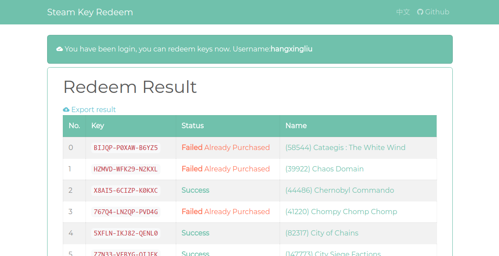

# STEAM KEY ONLINE REDEEM

[->中文文档<-](README.zh-CN.md)

You can redeem steam game keys automatically in local os remote.

For example:

- Deploying this server in other country for redeeming keys cross area.
- Redeeming a keys bundle only one click

HongKong demo redeeming server: <https://steamis.me> .
Thanks [Htroy (@FsHtroy)](https://github.com/FsHtroy) for supporting this server.

## Screenshot

## How to use

### Installing Node.js Environment

At least
[Node.js](https://nodejs.org/en/)
6.0

### Installing dependencies, Configuring 

1. Executing command `npm install --only=production`
2. Renaming file `serverconfig.example.json` to `serverconfig.json`
3. [Optional] Configuring `serverconfig.json`

### Launching(Local)

1. Executing command `npm start`
2. Visiting in browser(Default port is 3999)

### Launching(Deploy in server)

1. Executing command `npm install pm2 -g`
2. Executing command `npm run deploy`
3. Visiting in browser(Default port is 3999)

## License

[MIT](LICENSE)

## Authors

[LiuYue (@hangxingliu)](https://github.com/hangxingliu)

This project based on [zyfworks/steam-key][ORIGINAL_REPO].

Original author: [Makazeu (@zyfworks)](https://github.com/zyfworks)

[ORIGINAL_REPO]: https://github.com/zyfworks
